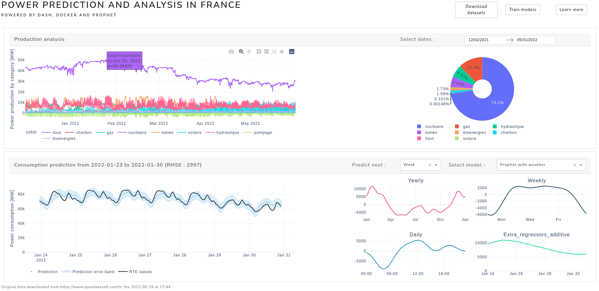

# Power prediction and analysis in France

## Description

A datascience project that shows the power production in France and predicts the consumption.

* A pipeline : to get, transform and serve the data
* A dashboard : to visualize the power production and prediction
* Prediction models based on `fbprophet` : to predict the power consumption for the next day, week, month or year!



## Installation

Two installation methods are povided, one with `Python` and `pyenv`, the other one with `Docker`.

### Installation with Python and pyenv

A simple way to install the librairies is to use a virtual environment powered `pyenv`. This method has been tested with the following versions of Python:

* 3.8.10
* and that's it for now!

The first step is to download the right version of Python according to the list above:

```pyenv install -v <python_version>```

The next step is the creation of the environment :

``` pyenv virtualenv <python_version> <project_name> ```

To activate the freshly created environment :

```pyenv activate <project_name>```

After the activation, install the requirements :

```pip install -r requirements.txt```

That's it !

### Installation with Docker

In this case, you only need `Docker`. The installation process will take place during the build of the container. To build it :

```docker-compose build```

## Run the projet

The project can be used in two ways : 

* as a pipeline
* as a dashboard 
* as a container 


> **_INFO:_** During the first launch, the three datasets are downloaded : this can take some time, approximately 5min ;)

### Run with Python

#### As a pipeline

This method allows you to run the pipeline without the dashboard :

```python src/pipeline.py <options>```

To see all available options, please use the `-h` option first.

#### As a dashboard

The dashboard is launched with the following command. Please look at available options with the `-h` option first.

```python src/app.py <options>```

### Run with Docker

The container is launched with the following command :

```docker-compose up```

Open your web browser and go to `<your-local-ip>:8050` to see the dashboard. Please adjust the ip address and the port to your needs in the `docker-compose.yml` file and the `Dockerfile` file. 

## Todos

Many things can be done to improve this project. For example :

* add unittests
* get the hourly temperatures from meteostat instead
* provide other prediction methods and compare them
* add  holiday periods in France : during Christmas holidays for example, the consumption prediction seems to be too high

## Licenses

The datasets are provided under Licence Ouverte / Open Licence V2.0 licenses.
